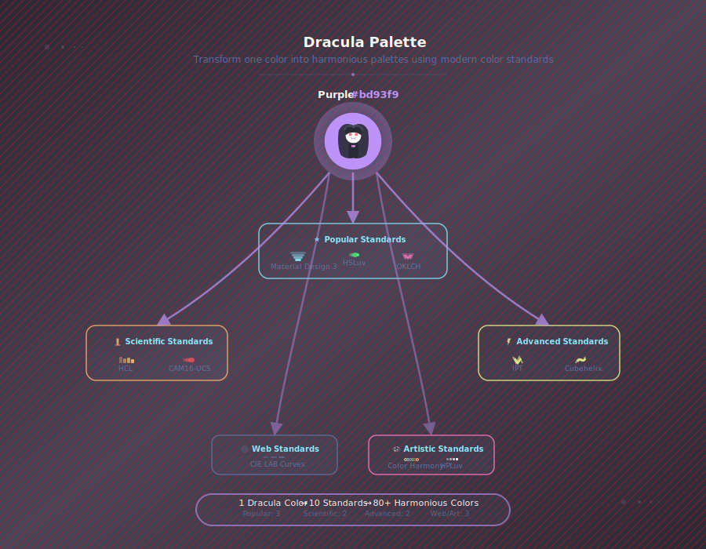
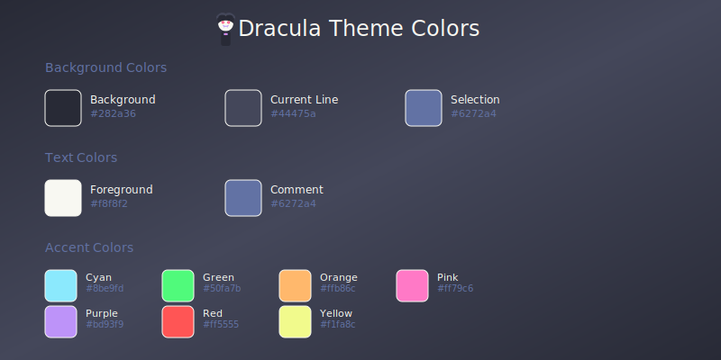

# Dracula Palette

🧛‍♂️ **Advanced Color Harmony Generator** - Transform any color into comprehensive Dracula-themed palettes using 10 modern color science standards.



## ✨ Features

### 🎯 Core Features (✅ Live)

- **🎨 Color Harmony Generation**: Transform any CSS color (hex, rgb, hsl, color names) into comprehensive Dracula-themed color harmonies
- **🌈 Advanced Palette System**: Generate extensive color palettes using 10 different color science standards
- **🎯 Intelligent Color Matching**: Find the 5 closest Dracula colors with precise similarity percentages
- **📊 Professional Color Standards**: Support for [Material Design 3](https://m3.material.io/styles/color/system/overview), [HSLuv](https://www.hsluv.org/), [OKLCH](https://oklch.com/), [HCL](https://colorspace.r-forge.r-project.org/articles/hcl_palettes.html), [CAM16-UCS](https://facelessuser.github.io/coloraide/colors/cam16_ucs/), [IPT](https://en.wikipedia.org/wiki/IPT_color_space), [Color Harmony](https://yalebooks.yale.edu/book/9780300179354/interaction-of-color/), [CIE LAB](https://cie.co.at/publications/colorimetry-part-4-cie-1976-lab-colour-space-1), [HPLuv](https://www.hsluv.org/), and [Cubehelix](https://people.phy.cam.ac.uk/dag9/CUBEHELIX/)
- **♿ Accessibility Engineering**: Built-in [WCAG](https://www.w3.org/WAI/WCAG22/Understanding/) compliance with automated "Make Accessible" color harmonies
- **📁 Professional Export**: Export individual colors (multiple formats) and complete palettes (CSS, SCSS, JSON)
- **📱 Responsive Design**: Optimized experience across desktop and mobile devices
- **⚡ Modern Architecture**: Built with Vue 3, TypeScript, and Vite for peak performance

### 🚧 Coming Soon

- **TailwindCSS & Figma Export**: Additional export formats (code ready, UI integration pending)
- **Batch Processing**: Upload and process multiple colors simultaneously
- **Advanced Color Harmonies**: Split-complementary, tetradic, and complex color schemes
- **Color Vision Simulation**: Preview palettes for different types of color blindness

## 🚀 Quick Start

1. **Visit the app**: [https://anselmoo.github.io/dracula-palette/](https://anselmoo.github.io/dracula-palette/)
2. **Enter any color** in the input field (try `#ff0000`, `rgb(255,0,0)`, or `red`)
3. **See suggestions** - The app will show the 5 closest Dracula colors
4. **Generate palettes** - Use the palette generator to create extended color schemes
5. **Export** - Download your palettes in various formats (CSS, SCSS, JSON)

## 🎯 Usage Guide

### Basic Color Harmony Matching

1. **Enter any color** in the input field (try `#ff0000`, `rgb(255,0,0)`, or `red`)
2. **Discover harmonies** - The app will show the 5 closest Dracula colors with similarity scores
3. **Click suggestions** to highlight them in the palette
4. **Export individual colors** - Click the export button on any color for HEX, RGB, HSL, OKLCH, LAB, etc.

### Advanced Palette Generation

1. **Select a Dracula color** from the main palette
2. **Choose color standards** using quick category buttons:
   - **Popular**: Material Design 3, HSLuv, OKLCH
   - **Scientific**: HCL, CAM16-UCS, IPT, Cubehelix
   - **Web**: CIE LAB curves
   - **Artistic**: Color Harmony, HPLuv
   - **All**: All 10 standards
3. **Generate extended palette** - Get 8-12 systematically created variants per standard
4. **Check accessibility** - Use "Make Accessible" for WCAG-compliant variants
5. **Export your palette** - Download in CSS, SCSS, or JSON format

### The Dracula Advantage

Traditional color pickers give you **one color**. The Dracula theme gives you **10 carefully curated colors**. But complex designs need **hundreds of colors** that work together.

This solves the original Dracula bottleneck by providing **hundreds of systematically generated colors** that maintain the Dracula aesthetic while offering the variety needed for complex designs.

## 🎨 Color Science

Support for 10 modern color standards organized by use case:

### 🌟 Popular Standards

- [Material Design 3](https://m3.material.io/styles/color/system/overview), [HSLuv](https://www.hsluv.org/), [OKLCH](https://oklch.com/)

### 🔬 Scientific Standards

- [HCL](https://colorspace.r-forge.r-project.org/articles/hcl_palettes.html), [CAM16-UCS](https://facelessuser.github.io/coloraide/colors/cam16_ucs/), [IPT](https://en.wikipedia.org/wiki/IPT_color_space), [Cubehelix](https://people.phy.cam.ac.uk/dag9/CUBEHELIX/)

### 🌐 Web Standards

- [CIE LAB](https://cie.co.at/publications/colorimetry-part-4-cie-1976-lab-colour-space-1) curves

### 🎨 Artistic Standards

- [Color Harmony](https://yalebooks.yale.edu/book/9780300179354/interaction-of-color/), [HPLuv](https://www.hsluv.org/)

## Key Features

- **Perceptually Uniform Calculations** with OKLCH-based similarity scoring
- **WCAG Accessibility Compliance** with "Make Accessible" button for contrast ratios
- **Multiple Export Formats**: Individual colors (HEX, RGB, HSL, OKLCH, LAB) and palettes (CSS, SCSS, JSON)

## 🧛‍♂️ Dracula Theme Colors



## 🤝 Contributing

We welcome contributions! Please see our [Contributing Guide](CONTRIBUTING.md) for details on:

- Development setup and workflow
- Code standards and testing
- Adding new color science algorithms
- Submitting bug reports and feature requests

## 🚀 Release & Deployment

### Automated Releases

This project uses automated releases with semantic versioning:

```bash
# Create a new release (patch version)
./scripts/release.sh patch

# Create a minor version release
./scripts/release.sh minor

# Create a major version release
./scripts/release.sh major
```

### Available Packages

- **npm (stable)**: `@anselmoo/dracula-palette@latest`
- **npm (dev)**: `@anselmoo/dracula-palette@dev`
- **Docker (stable)**: `ghcr.io/anselmoo/dracula-palette:latest`
- **Docker (dev)**: `ghcr.io/anselmoo/dracula-palette:dev`
- **GitHub Pages**: [https://anselmoo.github.io/dracula-palette/](https://anselmoo.github.io/dracula-palette/)

### Security Features

- **Container Signing**: All Docker images are signed with [Cosign](https://docs.sigstore.dev/cosign/overview/) using GitHub's OIDC Token for enhanced security and supply chain transparency
- **Keyless Signing**: No private keys required - uses GitHub's OIDC identity for tamper-proof image signatures
- **Token-Based Authentication**: Docker publishing uses only `GITHUB_TOKEN` (no personal access tokens required)

### Release Channels

1. **Development Builds** (main branch): Overwritten dev tags for testing
   - npm: `@anselmoo/dracula-palette@dev` (always latest main)
   - Docker: `ghcr.io/anselmoo/dracula-palette:dev` (always latest main)

2. **Semantic Releases** (Git tags): Traditional semver (v1.2.3)
   - npm: `@anselmoo/dracula-palette@latest` (stable releases)
   - Docker: `ghcr.io/anselmoo/dracula-palette:latest` (stable releases)

See [scripts/README.md](scripts/README.md) for detailed release documentation.

## 🌟 Inspiration

This project is inspired by:

- [Material Color Converter](https://pkief.github.io/material-color-converter/) by PKief
- [Dracula Theme](https://draculatheme.com/) official specification
- Modern color science research (OKLCH, CAM16-UCS)

## 📄 License

This project is licensed under the MIT License - see the [LICENSE](LICENSE) file for details.

## 🙏 Acknowledgments

- [Dracula Theme](https://draculatheme.com/) community
- [PKief](https://github.com/PKief) for the Material Color Converter inspiration
- [Björn Ottosson](https://bottosson.github.io/posts/oklab/) for OKLCH color space research
- Vue.js and Vite teams for excellent developer tools

## 🔗 Links

- [Dracula Theme Official Site](https://draculatheme.com/)
- [Contribute to Dracula](https://draculatheme.com/contribute)
- [OKLCH Color Picker](https://oklch.com/)
- [Material Color Converter](https://github.com/PKief/material-color-converter)
