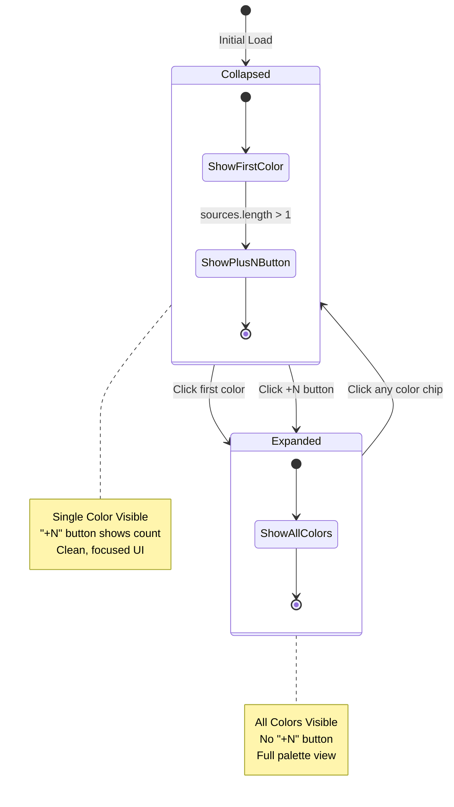
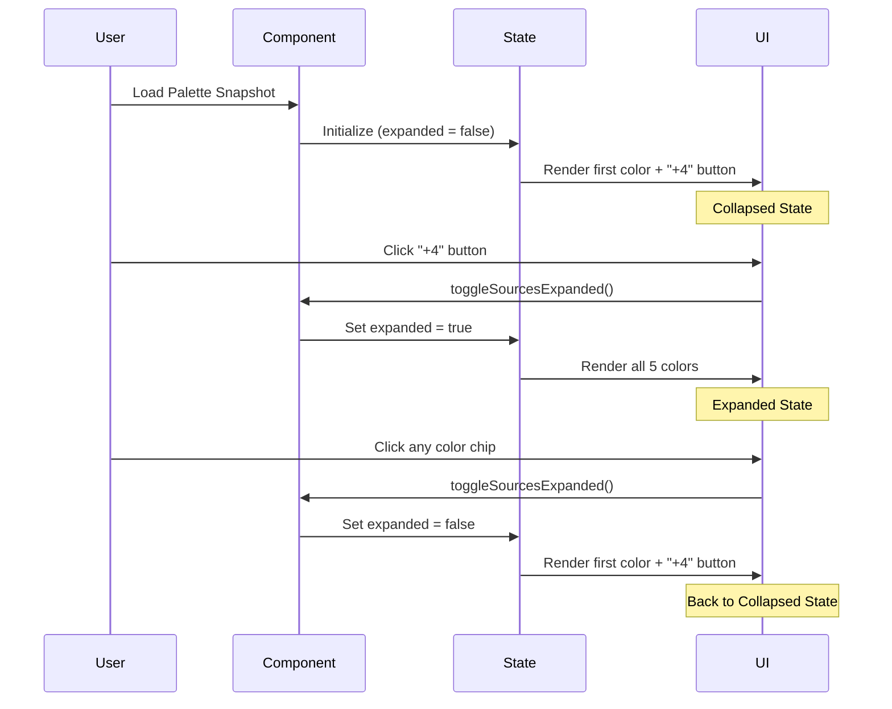
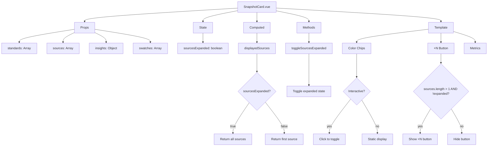
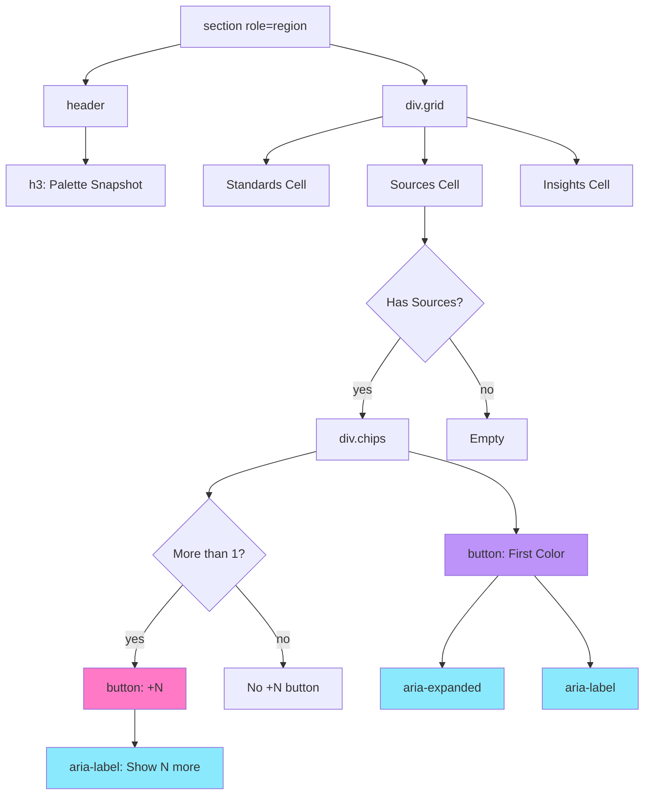
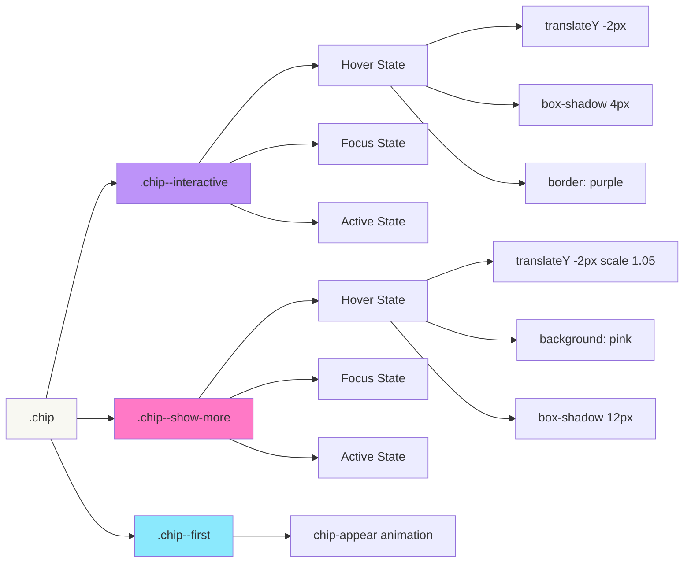

# Collapsible Color Sources - Visual Flow

## State Diagram

```mermaid
stateDiagram-v2
    [*] --> Collapsed: Initial Load
    
    Collapsed --> Expanded: Click first color
    Collapsed --> Expanded: Click +N button
    
    Expanded --> Collapsed: Click any color chip
    
    state Collapsed {
        [*] --> ShowFirstColor
        ShowFirstColor --> ShowPlusNButton: sources.length > 1
        ShowPlusNButton --> [*]
    }
    
    state Expanded {
        [*] --> ShowAllColors
        ShowAllColors --> [*]
    }
    
    note right of Collapsed
        Single Color Visible
        "+N" button shows count
        Clean, focused UI
    end note
    
    note right of Expanded
        All Colors Visible
        No "+N" button
        Full palette view
    end note
```

## User Interaction Flow

```mermaid
sequenceDiagram
    participant User
    participant Component
    participant State
    participant UI
    
    User->>Component: Load Palette Snapshot
    Component->>State: Initialize (expanded = false)
    State->>UI: Render first color + "+4" button
    
    Note over UI: Collapsed State
    
    User->>UI: Click "+4" button
    UI->>Component: toggleSourcesExpanded()
    Component->>State: Set expanded = true
    State->>UI: Render all 5 colors
    
    Note over UI: Expanded State
    
    User->>UI: Click any color chip
    UI->>Component: toggleSourcesExpanded()
    Component->>State: Set expanded = false
    State->>UI: Render first color + "+4" button
    
    Note over UI: Back to Collapsed State
```

## Component Architecture

```mermaid
graph TB
    A[SnapshotCard.vue] --> B[Props]
    A --> C[State]
    A --> D[Computed]
    A --> E[Methods]
    A --> F[Template]
    
    B --> B1[standards: Array]
    B --> B2[sources: Array]
    B --> B3[insights: Object]
    B --> B4[swatches: Array]
    
    C --> C1[sourcesExpanded: boolean]
    
    D --> D1[displayedSources]
    D1 --> D2{sourcesExpanded?}
    D2 -->|true| D3[Return all sources]
    D2 -->|false| D4[Return first source]
    
    E --> E1[toggleSourcesExpanded]
    E1 --> E2[Toggle expanded state]
    
    F --> F1[Color Chips]
    F --> F2[+N Button]
    F --> F3[Metrics]
    
    F1 --> G{Interactive?}
    G -->|yes| H[Click to toggle]
    G -->|no| I[Static display]
    
    F2 --> J{sources.length > 1 AND !expanded?}
    J -->|yes| K[Show +N button]
    J -->|no| L[Hide button]
```

## Animation Timeline

```mermaid
gantt
    title Color Chip Appearance Animation
    dateFormat X
    axisFormat %L
    
    section Chip Appear
    Opacity 0→1           :0, 300
    Scale 0.8→1           :0, 300
    
    section Hover Effect
    Transform Y(0→-2px)   :0, 150
    Box Shadow (0→8px)    :0, 150
    Border Color Change   :0, 150
    
    section Click Effect
    Transform Y(-2px→0)   :0, 100
    
    section +N Button Hover
    Scale 1→1.05          :0, 150
    Background Purple→Pink:0, 150
    Box Shadow Increase   :0, 150
```

## Accessibility Tree

```mermaid
graph TD
    A[section role=region] --> B[header]
    A --> C[div.grid]
    
    B --> D[h3: Palette Snapshot]
    
    C --> E[Standards Cell]
    C --> F[Sources Cell]
    C --> G[Insights Cell]
    
    F --> H{Has Sources?}
    H -->|yes| I[div.chips]
    H -->|no| J[Empty]
    
    I --> K[button: First Color]
    I --> L{More than 1?}
    L -->|yes| M[button: +N]
    L -->|no| N[No +N button]
    
    K --> O[aria-expanded]
    K --> P[aria-label]
    
    M --> Q[aria-label: Show N more]
    
    style K fill:#bd93f9
    style M fill:#ff79c6
    style O fill:#8be9fd
    style P fill:#8be9fd
    style Q fill:#8be9fd
```

## CSS Class Hierarchy

```mermaid
graph LR
    A[.chip] --> B[.chip--interactive]
    A --> C[.chip--show-more]
    A --> D[.chip--first]
    
    B --> E[Hover State]
    B --> F[Focus State]
    B --> G[Active State]
    
    C --> H[Hover State]
    C --> I[Focus State]
    C --> J[Active State]
    
    D --> K[chip-appear animation]
    
    E --> L[translateY -2px]
    E --> M[box-shadow 4px]
    E --> N[border: purple]
    
    H --> O[translateY -2px scale 1.05]
    H --> P[background: pink]
    H --> Q[box-shadow 12px]
    
    style A fill:#f8f8f2
    style B fill:#bd93f9
    style C fill:#ff79c6
    style D fill:#8be9fd
```
